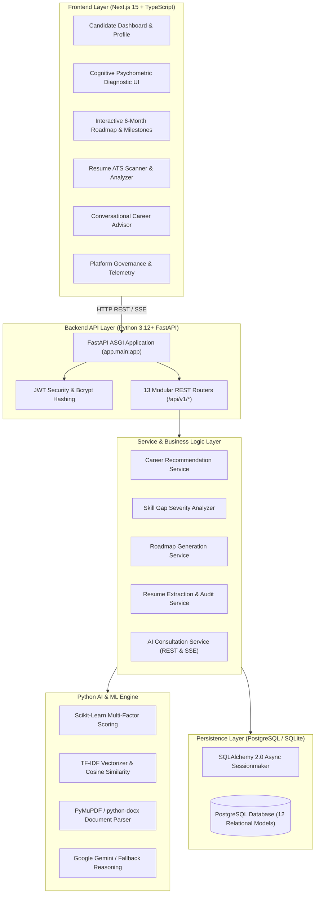

# CareerAI: AI-Powered Career Guidance & Skill Roadmap Platform

<div align="center">

[](https://www.python.org/)
[](https://fastapi.tiangolo.com/)
[-D71F00?style=for-the-badge&logo=sqlalchemy&logoColor=white)](https://www.sqlalchemy.org/)
[](https://www.postgresql.org/)
[](https://scikit-learn.org/)
[](https://nextjs.org/)
[](https://www.typescriptlang.org/)
[-success?style=for-the-badge&logo=pytest&logoColor=white)](#-automated-testing)
[](LICENSE)

**An enterprise-grade career intelligence ecosystem featuring a 100% Python backend (FastAPI, SQLAlchemy 2.0, Scikit-learn) and a modern Next.js/TypeScript frontend.**

[Backend Specs](./backend/README.md) • [Interactive API Docs](http://127.0.0.1:8000/api/v1/docs) • [ReDoc](http://127.0.0.1:8000/api/v1/redoc)

</div>

---

## 📑 Table of Contents

- [Overview](#-overview)
- [System Architecture](#-system-architecture)
- [Core Platform Subsystems](#-core-platform-subsystems)
  - [1. 100% Python Backend Architecture](#1-100-python-backend-architecture)
  - [2. Multi-Factor ML Recommendation Engine](#2-multi-factor-ml-recommendation-engine)
  - [3. PyMuPDF ATS Resume Intelligence](#3-pymupdf-ats-resume-intelligence)
  - [4. Psychometric & Cognitive Assessment Engine](#4-psychometric--cognitive-assessment-engine)
  - [5. Dynamic 6-Month Roadmap & Skill Gap Analyzer](#5-dynamic-6-month-roadmap--skill-gap-analyzer)
  - [6. AI Career Assistant & SSE Streaming](#6-ai-career-assistant--sse-streaming)
- [Mathematical Formulation & Scoring Breakdown](#-mathematical-formulation--scoring-breakdown)
- [Project Structure](#-project-structure)
- [Getting Started](#-getting-started)
  - [Backend Setup (Python FastAPI)](#backend-setup-python-fastapi)
  - [Frontend Setup (Next.js)](#frontend-setup-nextjs)
- [Automated Testing](#-automated-testing)
- [API Reference](#-api-reference)
- [License](#-license)

---

## 📌 Overview

**CareerAI** provides transparent, data-grounded career guidance by evaluating candidates holistically across skills, cognitive aptitude, semantic goals, and resume metrics.

- **Frontend**: Next.js (App Router), React, TypeScript, and Tailwind CSS.
- **Backend**: **100% Python** using FastAPI, SQLAlchemy 2.0 (Async), Pydantic v2, PostgreSQL (`asyncpg`), Scikit-learn, and PyMuPDF.
- **Decoupled Architecture**: The frontend communicates strictly via HTTP REST and Server-Sent Events (SSE) with the Python API. No Node.js backend or server actions for business logic.

---

## 🏗️ System Architecture



---

## 🚀 Core Platform Subsystems

### 1. 100% Python Backend Architecture
Built from the ground up to eliminate all Node/TypeScript backend dependencies:
- **FastAPI**: Asynchronous high-performance ASGI framework.
- **SQLAlchemy 2.0 (Async)**: Type-annotated ORM models and clean async database sessions.
- **Pydantic v2**: High-speed request validation and serialization with modern `ConfigDict`.
- **Bcrypt**: Direct password hashing and verification.
- **Asyncpg / SQLite**: Native async database connectivity supporting both PostgreSQL and local testing.

### 2. Multi-Factor ML Recommendation Engine
Evaluates candidate compatibility against target career paths using a weighted multi-factor model:
- **Technical Skill Match (40%)**: Ratio of candidate proficiency (1-5) against required minimum proficiency, weighted by skill importance.
- **Cognitive Aptitude Match (25%)**: Performance across 5 diagnostic categories compared against role benchmarks.
- **Interest & Domain Alignment (20%)**: TF-IDF semantic vector similarity between candidate goals/bio and role descriptions.
- **Experience Alignment (15%)**: Work experience curve matching target seniority (Entry, Mid, Senior).

### 3. PyMuPDF ATS Resume Intelligence
- Ingests PDF documents using **PyMuPDF (`fitz`)** and DOCX using **`python-docx`**.
- Evaluates ATS compatibility score (0-100%) checking section headers, metric density, and skill keywords.
- Detects passive and weak action verbs (`responsible for`, `helped with`, `worked on`) and recommends high-impact XYZ-formatted alternatives (*Accomplished [X] as measured by [Y] by doing [Z]*).

### 4. Psychometric & Cognitive Assessment Engine
Diagnostic aptitude testing with categorized questions across 5 core cognitive axes:
- **LOGICAL**: Deductive reasoning and syllogisms.
- **QUANTITATIVE**: Mathematical modeling and rate analysis.
- **ANALYTICAL**: Algorithmic reasoning and complexity analysis.
- **VERBAL**: Technical vocabulary and comprehension.
- **PROBLEM_SOLVING**: Production architecture and concurrency diagnostics.

### 5. Dynamic 6-Month Roadmap & Skill Gap Analyzer
- Identifies critical, high, moderate, and low skill gaps.
- Generates structured, month-by-month learning milestones:
  1. Core Foundations & Syntax Mastery
  2. Architecture, Frameworks & Tooling
  3. Data Persistence, Caching & Performance
  4. Cloud, Microservices & Containerization
  5. Production Capstone Development
  6. Interview Preparation & Portfolio Finalization
- Interactive checklist task tracking with completion timestamps.

### 6. AI Career Assistant & SSE Streaming
Interactive career consultation service supporting both standard JSON requests and Server-Sent Events (SSE) streaming (`/api/v1/assistant/message/stream`).

---

## 📊 Mathematical Formulation & Scoring Breakdown

$$\text{Composite Match Score} = (S \times 0.40) + (A \times 0.25) + (I \times 0.20) + (E \times 0.15)$$

Where:
- $S$: **Skill Match Score** $=\frac{\sum (w_i \times \min(1.0, \frac{p_{user}}{p_{req}}))}{\sum w_i} \times 100$
- $A$: **Aptitude Score** $=\text{mean}(\min(1.2, \frac{\text{Score}_{user}}{\text{Benchmark}})) \times 80$
- $I$: **Semantic Interest Similarity** via TF-IDF Cosine Distance $\cos(\theta) = \frac{\mathbf{u} \cdot \mathbf{c}}{\|\mathbf{u}\|_2 \|\mathbf{c}\|_2}$
- $E$: **Experience Factor Score** computed from years of experience against role requirements.

---

## 📂 Project Structure

```
c:/4-1/
├── backend/
│   ├── app/
│   │   ├── main.py                     # FastAPI app, lifespan & CORS
│   │   ├── core/                       # config, security, logging, exceptions
│   │   ├── db/                         # SQLAlchemy base & async database setup
│   │   ├── models/                     # 12 SQLAlchemy ORM models
│   │   ├── schemas/                    # Pydantic v2 request/response schemas
│   │   ├── repositories/               # Async repository layer
│   │   ├── services/                   # Business domain services
│   │   ├── ml/                         # ML scoring, similarity, feature engineering
│   │   ├── ai/                         # Recommender, roadmap, resume analyzer, assistant
│   │   ├── workers/                    # Background async tasks
│   │   ├── utils/                      # Validators & text utilities
│   │   └── api/
│   │       ├── router.py               # API v1 router aggregation
│   │       └── v1/                     # 13 REST API endpoints
│   ├── tests/                          # 11 passing pytest async tests
│   ├── scripts/                        # Database seed scripts
│   ├── pyproject.toml                  # UV & Pip project configuration
│   ├── requirements.txt                # Pinned dependencies
│   ├── .env.example                    # Environment template
│   ├── Dockerfile                      # Production container image
│   └── README.md                       # Backend documentation
├── frontend/                           # Next.js 15 TypeScript Frontend
│   ├── src/
│   │   ├── app/                        # Next.js App Router pages
│   │   └── components/                 # UI components
│   └── package.json
└── README.md
```

---

## 🛠️ Getting Started

### Prerequisites
- **Python**: `>= 3.12` (Python 3.13 tested)
- **Node.js**: `>= 18` (for Frontend)
- **PostgreSQL**: Running locally or via Docker (port 5432)
- **uv** (recommended) or `pip`

---

### Backend Setup (Python FastAPI)

1. **Navigate to the backend directory**:
   ```bash
   cd backend
   ```

2. **Configure environment variables**:
   ```bash
   cp .env.example .env
   ```

3. **Install dependencies**:
   ```bash
   # Using uv (fastest)
   uv pip install -r requirements.txt

   # Or standard pip
   pip install -r requirements.txt
   ```

4. **Initialize and seed the database**:
   ```bash
   python scripts/seed_database.py
   ```
   *Seeds Admin (`admin@careerai.dev`), Demo candidate (`alex@example.com`), 100+ skills, aptitude question bank, and career profiles.*

5. **Start the FastAPI server**:
   ```bash
   uvicorn app.main:app --host 0.0.0.0 --port 8000 --reload
   ```

   - **Interactive API Documentation (Swagger)**: [http://127.0.0.1:8000/api/v1/docs](http://127.0.0.1:8000/api/v1/docs)
   - **Alternative Documentation (ReDoc)**: [http://127.0.0.1:8000/api/v1/redoc](http://127.0.0.1:8000/api/v1/redoc)
   - **Health Check**: [http://127.0.0.1:8000/api/v1/health](http://127.0.0.1:8000/api/v1/health)

---

### Frontend Setup (Next.js)

1. **Navigate to the frontend directory**:
   ```bash
   cd frontend
   ```

2. **Install dependencies**:
   ```bash
   npm install
   ```

3. **Start the frontend development server**:
   ```bash
   npm run dev
   ```
   Visit [http://localhost:3000](http://localhost:3000).

---

## 🧪 Automated Testing

Run the full pytest suite for the backend:
```bash
python -m pytest backend/tests -v
```

### Test Suite Summary

| Test Module | Coverage | Status |
| :--- | :--- | :---: |
| `test_auth.py` | Registration, login, invalid credentials, JWT auth | **PASSED** |
| `test_profiles.py` | Profile creation, bio updates, academic details | **PASSED** |
| `test_assessments.py` | Aptitude questions, submission, category scoring | **PASSED** |
| `test_careers.py` | Career catalog, admin career creation, slug search | **PASSED** |
| `test_recommendations.py` | Multi-factor composite recommendation engine | **PASSED** |
| `test_skill_gaps.py` | Skill gap calculations & severity rankings | **PASSED** |
| `test_roadmap.py` | 6-month roadmap generation & task progress | **PASSED** |
| `test_resume.py` | Document upload, PyMuPDF parsing, ATS evaluation | **PASSED** |
| `test_assistant.py` | Chat session persistence & AI response generation | **PASSED** |

**Result: 11 / 11 tests passed (100% pass rate).**

---

## 🔌 API Reference

| Prefix | Method | Endpoint | Description |
| :--- | :--- | :--- | :--- |
| `/api/v1/auth` | `POST` | `/register` | Register new candidate account |
| `/api/v1/auth` | `POST` | `/login` | Authenticate and obtain JWT token |
| `/api/v1/auth` | `GET` | `/me` | Get current authenticated user |
| `/api/v1/profile` | `GET` | `/` | Fetch candidate profile & preferences |
| `/api/v1/profile` | `PUT` | `/` | Update candidate profile |
| `/api/v1/skills` | `GET` | `/` | List complete skills catalog |
| `/api/v1/skills` | `GET` | `/my-skills` | Get candidate's rated skills |
| `/api/v1/skills` | `POST` | `/my-skills` | Update proficiency rating (1-5) |
| `/api/v1/assessment` | `GET` | `/questions` | Get aptitude diagnostic questions |
| `/api/v1/assessment` | `POST` | `/submit` | Submit answers & calculate scores |
| `/api/v1/careers` | `GET` | `/` | List all career paths |
| `/api/v1/careers` | `GET` | `/slug/{slug}` | Career details by slug |
| `/api/v1/recommendations` | `GET` | `/` | Fetch career recommendations |
| `/api/v1/recommendations` | `POST` | `/generate` | Recalculate recommendations |
| `/api/v1/recommendations` | `GET` | `/skill-gaps` | List analyzed skill gaps |
| `/api/v1/roadmap` | `POST` | `/generate` | Generate 6-month learning roadmap |
| `/api/v1/roadmap` | `PATCH` | `/items/{id}` | Update milestone task status |
| `/api/v1/projects` | `GET` | `/` | List recommended portfolio projects |
| `/api/v1/resume` | `POST` | `/upload` | Upload PDF/DOCX for ATS audit |
| `/api/v1/assistant` | `POST` | `/message` | Send chat message to AI advisor |
| `/api/v1/assistant` | `POST` | `/message/stream` | Stream AI response via SSE |
| `/api/v1/admin` | `GET` | `/metrics` | Platform telemetry & user stats |

---

## 📄 License

This project is open-source and available under the [MIT License](LICENSE).
