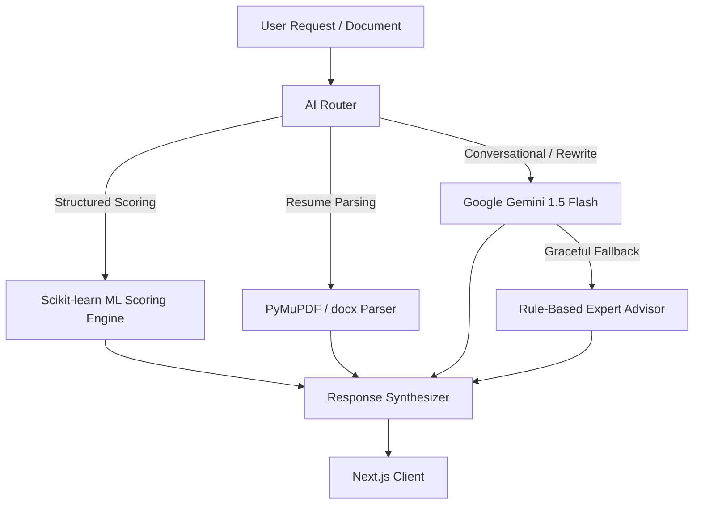

# 🏗️ AI Subsystem Architecture

## 1. Multi-Tiered Intelligence Pattern
CareerAI decouples deterministic algorithmic reasoning from probabilistic Large Language Models:
1. **Deterministic ML Tier**: Fast, reproducible mathematical scoring (Scikit-learn, TF-IDF cosine similarity, weighted vector algebra) handles all match rankings and gap evaluations.
2. **Probabilistic LLM Tier**: Google Gemini 1.5 Flash (with fallback to local deterministic domain logic) generates natural language explanations, resume rewrite suggestions, and interactive conversational guidance.

---

## 2. High Resilience & Offline Fallbacks
If the `GEMINI_API_KEY` is missing or upstream APIs experience rate limits, the system seamlessly activates built-in deterministic expert modules without raising exceptions.
