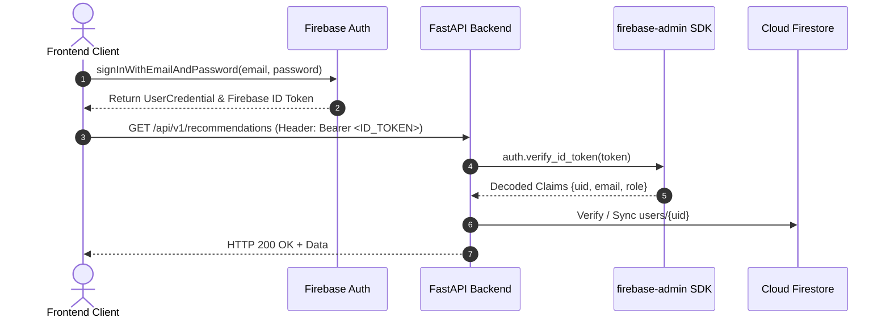

# 🔑 Firebase Authentication & Token Verification

## 1. Overview
Identity management is delegated to Firebase Authentication. The client authenticates using the Firebase Web SDK and receives a cryptographically signed Firebase ID token (JWT).

---

## 2. Authentication Flow



---

## 3. Python Verification Implementation
Located in `backend/app/firebase/auth.py`:

```python
from firebase_admin import auth
from app.core.exceptions import AuthenticationError

def verify_firebase_token(id_token: str) -> dict:
    try:
        decoded_token = auth.verify_id_token(id_token)
        return decoded_token
    except auth.ExpiredIdTokenError:
        raise AuthenticationError("Firebase ID token has expired.")
    except auth.InvalidIdTokenError:
        raise AuthenticationError("Invalid Firebase ID token.")
```

---

## 4. Role-Based Access Control (RBAC)
Custom claims are assigned to denote administrator privileges:
```python
auth.set_custom_user_claims(uid, {"role": "ADMIN"})
```
The FastAPI dependency `get_current_admin` verifies `token.role == "ADMIN"` before granting access to telemetry or catalog mutations.
