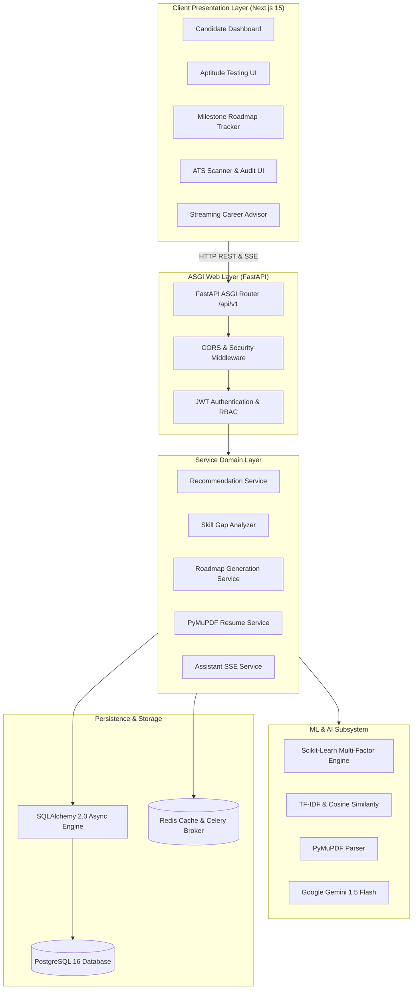

# 🏛️ System Architecture

## 1. High-Level Architectural Pattern
CareerAI implements a **Decoupled Asynchronous Micro-Monolith Architecture** composed of:
1. **Frontend Presentation Tier**: Next.js 15 (App Router), React 19, TypeScript, Tailwind CSS, Lucide icons.
2. **API & Business Logic Tier**: Python 3.12+ FastAPI ASGI application with dependency injection, Pydantic v2 schemas, and asynchronous service orchestration.
3. **ML & AI Intelligence Subsystem**: Scikit-Learn TF-IDF vectorizers, Cosine similarity matrices, PyMuPDF document parser, and Google Gemini 1.5 Flash.
4. **Data Persistence Tier**: PostgreSQL 16+ via SQLAlchemy 2.0 Async Sessionmaker (`asyncpg`), with SQLite fallback.
5. **Background Workers & Caching**: Redis broker with Celery task queues for asynchronous resume extraction and model re-indexing.

---

## 2. Architecture Diagram (Mermaid)

---

## 3. Subsystem Breakdown

### 3.1 Presentation Layer (`frontend/src/app`)
- **App Router Routing**: Clean URL routing (`/dashboard`, `/assessment`, `/recommendations`, `/roadmap`, `/resume`, `/chat`, `/admin`).
- **Data Fetching**: Pure client-side `fetch` with token-bearer interceptors. Zero Node server action leakage.
- **Visual System**: Crisp high-contrast clean aesthetic with dynamic metric cards and progress indicators.

### 3.2 Service Layer (`backend/app/services/`)
- Pure domain services decoupled from HTTP controllers.
- Methods accept standard Pydantic models or primitives and return domain response objects.

### 3.3 Persistence Layer (`backend/app/db/` & `backend/app/models/`)
- Fully async SQLAlchemy 2.0 models using `Mapped[]` type hints.
- Connection pooling with `pool_size=20`, `max_overflow=10`, `pool_pre_ping=True`.
