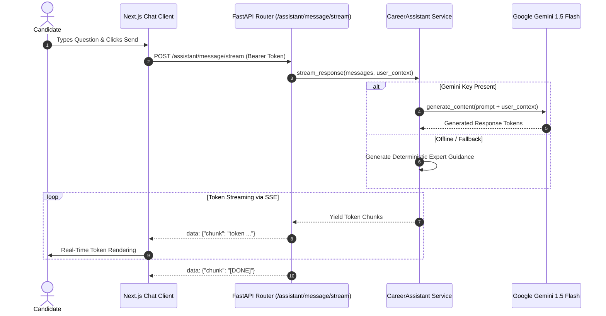

# 🤖 AI Assistant Streaming Flow Diagram

```mermaid
sequenceDiagram
    autonumber
    actor User as Candidate
    participant Client as Next.js Chat Client
    participant API as FastAPI Router (/assistant/message/stream)
    participant Assistant as CareerAssistant Service
    participant Gemini as Google Gemini 1.5 Flash

    User->>Client: Types Question & Clicks Send
    Client->>API: POST /assistant/message/stream (Bearer Token)
    API->>Assistant: stream_response(messages, user_context)
    alt Gemini Key Present
        Assistant->>Gemini: generate_content(prompt + user_context)
        Gemini-->>Assistant: Generated Response Tokens
    else Offline / Fallback
        Assistant->>Assistant: Generate Deterministic Expert Guidance
    end
    loop Token Streaming via SSE
        Assistant-->>API: Yield Token Chunks
        API-->>Client: data: {"chunk": "token ..."}
        Client->>User: Real-Time Token Rendering
    end
    API-->>Client: data: {"chunk": "[DONE]"}
```
