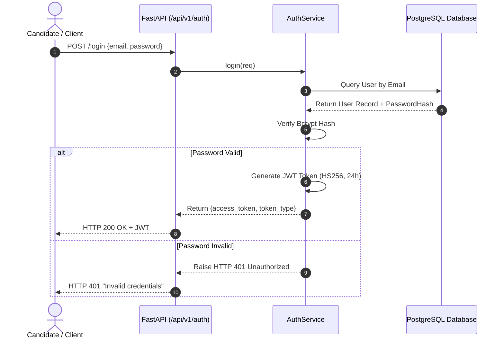

# 🔐 Authentication Flow Diagram

```mermaid
sequenceDiagram
    autonumber
    actor User as Candidate / Client
    participant API as FastAPI (/api/v1/auth)
    participant AuthSvc as AuthService
    participant DB as PostgreSQL Database

    User->>API: POST /login {email, password}
    API->>AuthSvc: login(req)
    AuthSvc->>DB: Query User by Email
    DB-->>AuthSvc: Return User Record + PasswordHash
    AuthSvc->>AuthSvc: Verify Bcrypt Hash
    alt Password Valid
        AuthSvc->>AuthSvc: Generate JWT Token (HS256, 24h)
        AuthSvc-->>API: Return {access_token, token_type}
        API-->>User: HTTP 200 OK + JWT
    else Password Invalid
        AuthSvc-->>API: Raise HTTP 401 Unauthorized
        API-->>User: HTTP 401 "Invalid credentials"
    end
```
