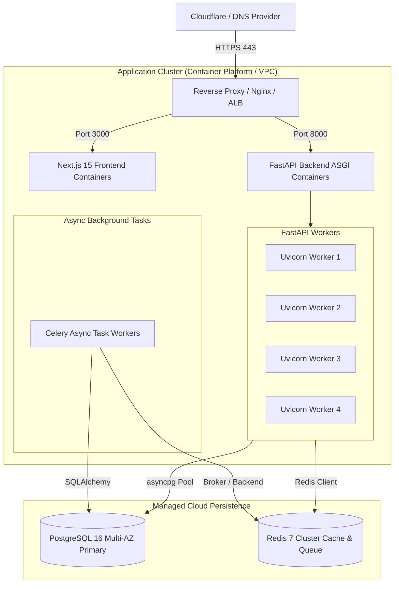

# 🌐 Deployment Architecture Diagram

```mermaid
flowchart TD
    DNS[Cloudflare / DNS Provider] -->|HTTPS 443| LB[Reverse Proxy / Nginx / ALB]

    subgraph Cluster ["Application Cluster (Container Platform / VPC)"]
        LB -->|Port 3000| NextJS[Next.js 15 Frontend Containers]
        LB -->|Port 8000| FastAPI[FastAPI Backend ASGI Containers]

        subgraph BackendCluster ["FastAPI Workers"]
            W1[Uvicorn Worker 1]
            W2[Uvicorn Worker 2]
            W3[Uvicorn Worker 3]
            W4[Uvicorn Worker 4]
        end
        FastAPI --> BackendCluster

        subgraph Workers ["Async Background Tasks"]
            Celery[Celery Async Task Workers]
        end
    end

    subgraph ManagedData ["Managed Cloud Persistence"]
        PG[(PostgreSQL 16 Multi-AZ Primary)]
        Redis[(Redis 7 Cluster Cache & Queue)]
    end

    BackendCluster -->|asyncpg Pool| PG
    BackendCluster -->|Redis Client| Redis
    Celery -->|Broker / Backend| Redis
    Celery -->|SQLAlchemy| PG
```
