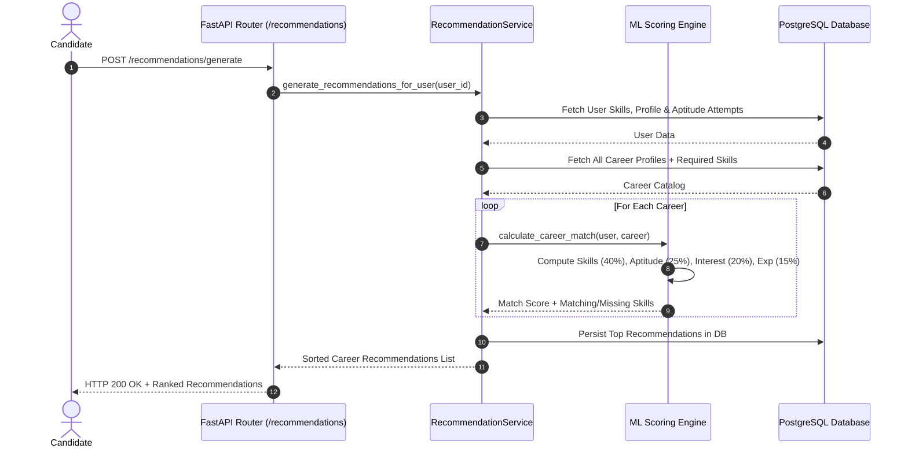

# 🎯 Career Recommendation Flow Diagram

```mermaid
sequenceDiagram
    autonumber
    actor User as Candidate
    participant API as FastAPI Router (/recommendations)
    participant RecSvc as RecommendationService
    participant ML as ML Scoring Engine
    participant DB as PostgreSQL Database

    User->>API: POST /recommendations/generate
    API->>RecSvc: generate_recommendations_for_user(user_id)
    RecSvc->>DB: Fetch User Skills, Profile & Aptitude Attempts
    DB-->>RecSvc: User Data
    RecSvc->>DB: Fetch All Career Profiles + Required Skills
    DB-->>RecSvc: Career Catalog
    loop For Each Career
        RecSvc->>ML: calculate_career_match(user, career)
        ML->>ML: Compute Skills (40%), Aptitude (25%), Interest (20%), Exp (15%)
        ML-->>RecSvc: Match Score + Matching/Missing Skills
    end
    RecSvc->>DB: Persist Top Recommendations in DB
    RecSvc-->>API: Sorted Career Recommendations List
    API-->>User: HTTP 200 OK + Ranked Recommendations
```
