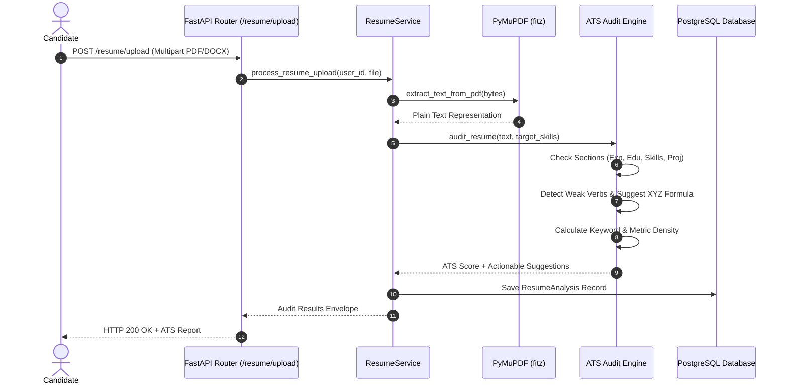

# 📄 Resume Analysis Flow Diagram

```mermaid
sequenceDiagram
    autonumber
    actor User as Candidate
    participant API as FastAPI Router (/resume/upload)
    participant Svc as ResumeService
    participant Parser as PyMuPDF (fitz)
    participant Analyzer as ATS Audit Engine
    participant DB as PostgreSQL Database

    User->>API: POST /resume/upload (Multipart PDF/DOCX)
    API->>Svc: process_resume_upload(user_id, file)
    Svc->>Parser: extract_text_from_pdf(bytes)
    Parser-->>Svc: Plain Text Representation
    Svc->>Analyzer: audit_resume(text, target_skills)
    Analyzer->>Analyzer: Check Sections (Exp, Edu, Skills, Proj)
    Analyzer->>Analyzer: Detect Weak Verbs & Suggest XYZ Formula
    Analyzer->>Analyzer: Calculate Keyword & Metric Density
    Analyzer-->>Svc: ATS Score + Actionable Suggestions
    Svc->>DB: Save ResumeAnalysis Record
    Svc-->>API: Audit Results Envelope
    API-->>User: HTTP 200 OK + ATS Report
```
