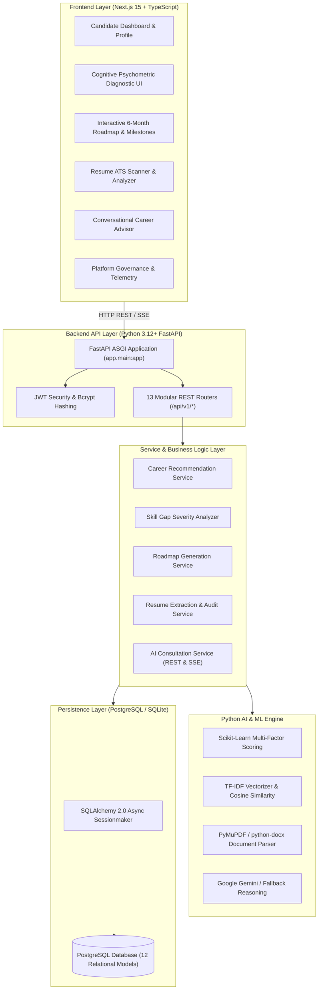

# 🏛️ System Architecture Diagram

```mermaid
flowchart TB
    subgraph Client ["Frontend Layer (Next.js 15 + TypeScript)"]
        UI["Candidate Dashboard & Profile"]
        AssessUI["Cognitive Psychometric Diagnostic UI"]
        RoadmapUI["Interactive 6-Month Roadmap & Milestones"]
        ResumeUI["Resume ATS Scanner & Analyzer"]
        ChatUI["Conversational Career Advisor"]
        AdminUI["Platform Governance & Telemetry"]
    end

    subgraph API ["Backend API Layer (Python 3.12+ FastAPI)"]
        FastAPI["FastAPI ASGI Application (app.main:app)"]
        AuthModule["JWT Security & Bcrypt Hashing"]
        Routers["13 Modular REST Routers (/api/v1/*)"]
    end

    subgraph Services ["Service & Business Logic Layer"]
        RecService["Career Recommendation Service"]
        GapService["Skill Gap Severity Analyzer"]
        RoadmapService["Roadmap Generation Service"]
        ResumeService["Resume Extraction & Audit Service"]
        ChatService["AI Consultation Service (REST & SSE)"]
    end

    subgraph Intelligence ["Python AI & ML Engine"]
        ScikitLearn["Scikit-Learn Multi-Factor Scoring"]
        TFIDF["TF-IDF Vectorizer & Cosine Similarity"]
        PyMuPDF["PyMuPDF / python-docx Document Parser"]
        Gemini["Google Gemini / Fallback Reasoning"]
    end

    subgraph Persistence ["Persistence Layer (PostgreSQL / SQLite)"]
        SQLAlchemy["SQLAlchemy 2.0 Async Sessionmaker"]
        PGDB[("PostgreSQL Database (12 Relational Models)")]
    end

    Client -->|HTTP REST / SSE| FastAPI
    FastAPI --> AuthModule
    FastAPI --> Routers
    Routers --> Services
    Services --> Intelligence
    Services --> Persistence
    Persistence --> PGDB
```
